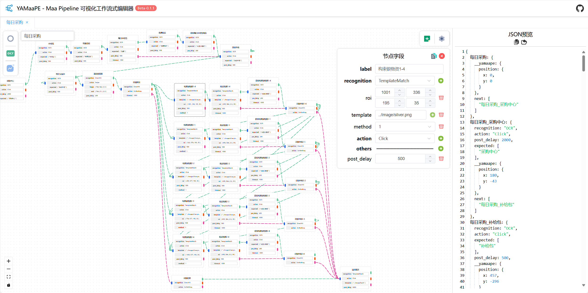
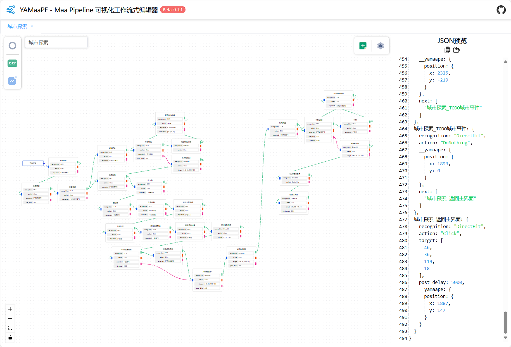

# YAMaaPE - Yet Another Maa Pipeline Editor 另一个 Maa Pipeline 可视化工作流式编辑器

## 介绍

一个基于 [vue-flow](https://github.com/bcakmakoglu/vue-flow) 的 [MaaFramework](https://github.com/MaaXYZ/MaaFramework) [Pipeline](https://github.com/MaaXYZ/MaaFramework/blob/main/docs/zh_cn/3.1-%E4%BB%BB%E5%8A%A1%E6%B5%81%E6%B0%B4%E7%BA%BF%E5%8D%8F%E8%AE%AE.md) 快速编写工具

可以看作是低代码的低代码，即把 json 文件使用工作流封装了一下。

你可以使用 YAMaaPE 快速搓出这样的流水线：

当然大多时候是这样的：

**在线体验**：https://yamaape.codax.site/

**使用方式**：[在线文档](./docs/guide.md)

**应用案例**：[MaaNewMoonAccompanying](https://github.com/kqcoxn/MaaNewMoonAccompanying)（新月同行小助手）

## What's the Point?

- ✨ 工作流交互面板
- ✨ 额外字段筛选显示
- ✨ 类型预判/字段说明
- ✨ 错误检查
- ✨ 自动生成 `next`、`interrupt`、`on_error` 字段
- ✨ 自动添加必选字段
- ✨JSON 预览
- ✨ 导入/导出
- ✨ 多文件编辑
- ✨ 本地缓存
- ✨ 更多特性等你体验！

## TODO

- 边权重设置
- 自定义模板节点
- `interface.json`支持
- 类型可选
- 分秒转换器

## 为什么是 "Yet Another" ？

- 官方版本：[MaaJsonViewer](https://github.com/MaaXYZ/MaaJsonViewer)（archived）
- MFA：
- [@YantaoMou](https://github.com/YantaoMou)：[MAAVisualEditor](https://github.com/YantaoMou/MAAVisualEditor)

## 更新记录

### v0.3.4

> 2025.5.3

- **新增**
  - JSON 栏按键提示
- **优化修复**
  - 调整 focus 规范
  - 修复了文件名同步异常的问题

### v0.3.3

> 2025.5.2

- **新增**
  - 添加节点排版工具

### v0.3.2

> 2025.4.29

- **新增**
  - 添加`prefix`通用设置
  - 将`delete`作为删除节点键
  - 自动补全`template`的`.png`后缀
- **优化修复**
  - 优化转换逻辑，取消强制规范
  - 修复了孤节点不能被保存的问题
  - 修复了修改 reco 或 action 字段时额外字段会冲突的问题

### v0.3.1

> 2025.4.19

- **新增**
  - 错误统一出口
  - `jump`字段
  - label 错误提示
- **优化修复**
  - 调整了部分字段的默认值
  - 修复了删除时若值为空则字段失效的问题
  - 修复了新增节点后删除操作仍然对原选中节点生效的问题
  - 加入延迟抖动更新

更早的版本

### v0.3.0

> 2025.4.17

- **新增**
  - 新增模板节点：位置点击节点
  - 添加了复制单个节点属性或名称的功能
  - 新增错误检查功能
- **优化修复**
  - 修复了批量移动节点后节点位置记录混乱的问题
  - 调整了部分字段的默认属性与自动额外字段添加，更接近实际使用

### Beta-0.2.1

> 2025.4.12

- **优化修复**
  - 修复了部分情况 JSON 解析错误的问题
  - 将添加字段的说明调整置右侧

### Beta-0.2.0

> 2025.4.12

- **新增功能**
  - 添加了复制粘贴功能
  - 选中节点新增时，自动连接两个节点
  - 新增/切换页面、导入 JSON 时自动聚焦
  - 导入 JSON 时自动更改文件名称
- **优化修复**
  - 修复了指针污染问题
  - 修复了部分字段属性模板错误
  - 修复了`interrupt`字段与`on_error`字段缓存失效的问题
  - 新增节点位置改为：若有选中节点，则新增在该节点右侧，否则在最右侧节点的右侧
  - 调整界面缩放范围

### Beta-0.1.0

> 2025.4.11

初次提交，基础功能实装

## 鸣谢

- [MaaFramework](https://github.com/MaaXYZ/MaaFramework)
